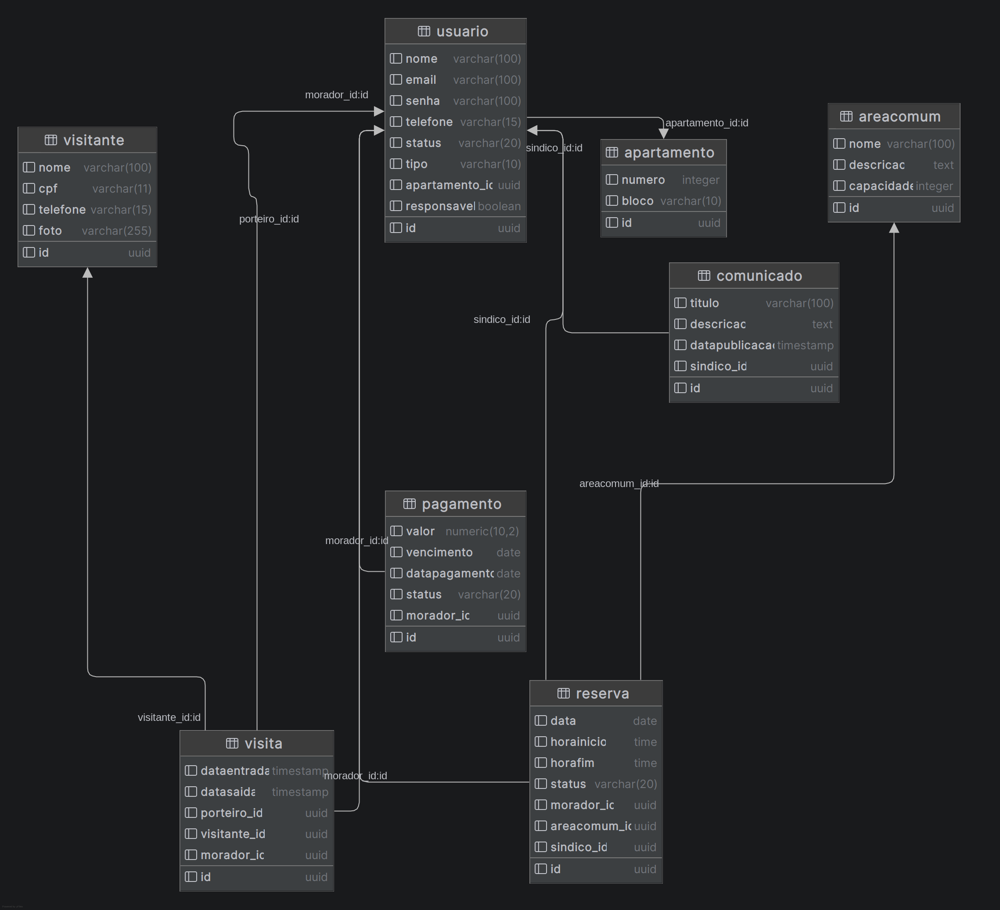
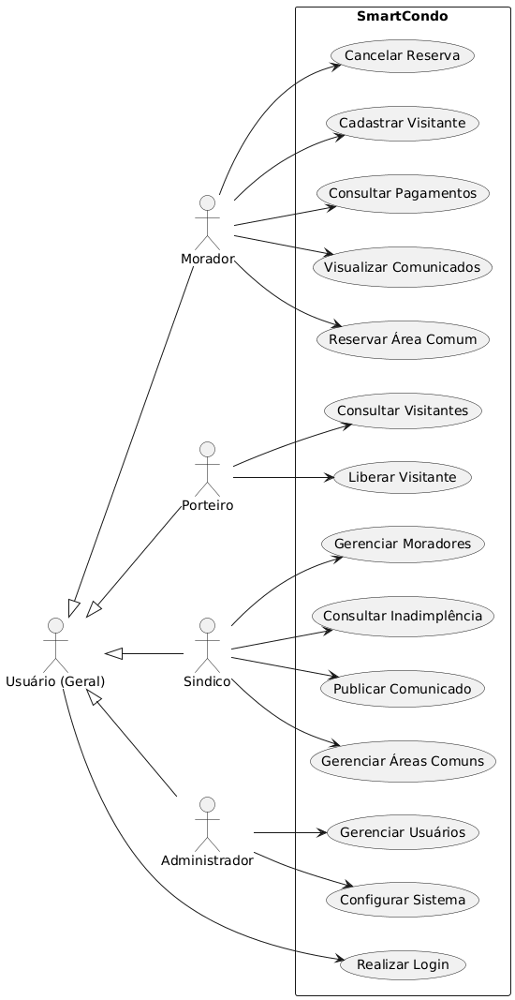
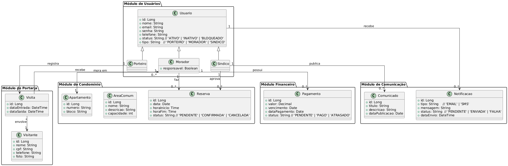
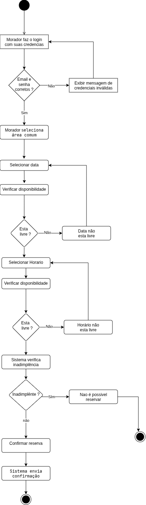
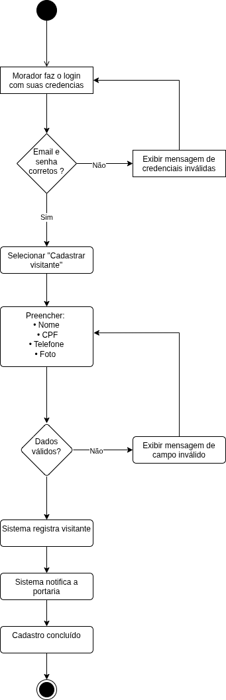

# SmartCondo

Sistema para administrar condomínios. Faz tudo em um lugar: pagamentos, reservas, visitantes e comunicados.

## O que faz

- Dashboard com tudo do condomínio
- Cadastro de moradores
- Lembrete de pagamento por e-mail e SMS (7 dias antes)
- Aviso quando não paga (1 dia depois)
- Reserva de áreas comuns (churrasqueira, salão, etc.)
- Cadastro de visitantes
- Controle de entrada e saída na portaria
- Comunicados do síndico
- Histórico de pagamentos e reservas

## Tecnologias

- PostgreSQL 16 (banco de dados)
- Docker Compose (para rodar o banco)

## Como rodar

1. Suba o banco de dados:
```bash
docker compose up -d
```

2. Acesse o PostgreSQL com:
   - Host: `localhost:5432`
   - User: `postgres`
   - Password: `postgres`
   - Database: `smartcondo`

3. Crie o primeiro usuário admin rodando o SQL abaixo no banco:
```sql
INSERT INTO "Usuario" (id, nome, email, senha, telefone, status, tipo)
VALUES (
  gen_random_uuid(),
  'Administrador',
  'admin@smartcondo.com',
  'senha123',
  '(11) 99999-9999',
  'ATIVO',
  'ADMINISTRADOR'
);
```

4. Use o email `admin@smartcondo.com` e senha `senha123` para entrar no sistema.

## Estrutura

```
smartCondo/
├── docs/
│   ├── 01-Introducao.md
│   ├── 02-Requisitos.md
│   ├── requisitos.md
│   ├── DER-fisico.png
│   ├── caso-de-uso.png
│   ├── classe.png
│   ├── diagrama-atividade.png
│   └── diagram-atividade-cadastro-visitante.png
├── database/
│   └── schema.sql
├── docker-compose.yml
└── README.md
```

## Banco de Dados

O banco tem 8 tabelas:

| Tabela | O que guarda |
|---|---|
| `Apartamento` | Unidades (número e bloco) |
| `Usuario` | Pessoas do sistema (morador, porteiro, síndico) |
| `Pagamento` | Taxas do condomínio |
| `AreaComum` | Lugares para reservar (salão, churrasqueira, etc.) |
| `Reserva` | Quem reservou qual lugar e quando |
| `Visitante` | Dados do visitante |
| `Visita` | Registro de entrada/saída na portaria |
| `Comunicado` | Avisos do síndico |

## Diagramas

### DER (Diagrama Entidade-Relacionamento)



### Caso de Uso



### Diagrama de Classes



### Diagrama de Atividades — Reserva



### Diagrama de Atividades — Cadastro de Visitante



## Documentação

- [Introdução](docs/01-Introducao.md) — O que é o projeto
- [Requisitos](docs/02-Requisitos.md) — O que o sistema precisa fazer
- [Requisitos originais](docs/requisitos.md) — Lista inicial dos requisitos
